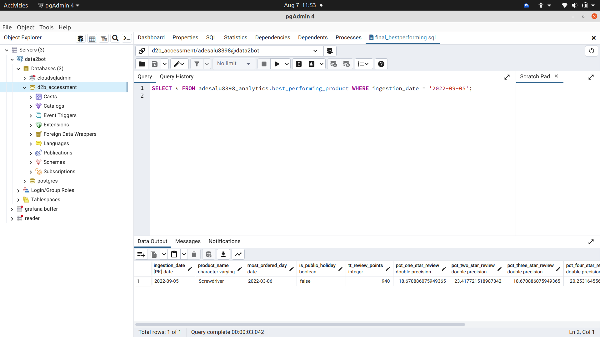

# Data2Bots-Data-Engineering-Assessment 

🏁 

Data Engineering Solution for Data2Bots Data Engineering Technical Assessment 👇 

This repository contains a comprehensive Data Engineering solution for Data2Bots central data lake, hosted on Amazon S3. The solution addresses the requirements provided by the business stakeholders and demonstrates a thoughtful approach to solving real-world Data Engineering challenges.

## Prerequisites

Install Terraform ([guide](https://learn.hashicorp.com/tutorials/terraform/install-cli))

An [AWS account](https://aws.amazon.com/free/) (free-tier available) with credentials configured for [Terraform](https://registry.terraform.io/providers/hashicorp/aws/latest/docs#authentication-and-configuration)

A Personal Computer or a Desktop Facility 💻

## Problem Statement

As the sole data engineer of Data2Bots, you have been tasked with designing and implementing a robust data pipeline to process and analyze data from the following files in the S3 bucket:

- `orders.csv`: Contains information about orders placed on the website ABC.com.
- `reviews.csv`: Contains data on reviews given for delivered products.
- `shipments_deliveries.csv`: Contains data on shipments and their delivery dates.

Your goal is to create an efficient ETL (Extract, Transform, Load) process to ingest, clean, and load the data into the data warehouse, following the data model shown in the ER diagram in the TT-Data2BotsDataEngineeringTechnicalAssessment-170922-1841.pdf document in the Data2Bots-Data-Engineering-Assessment/data directory.

## Schema Explanaition

The relationship between the variables in the data model tables are explained   [here](./Terraform/PostgreSQLSchema_management/schemadefinition.txt)

## Solution Overview

This solution leverages Python 

SQL   Terraform

 Authentication & Authorization
and AWS Services

to accomplish the ETL process

1. **Extraction**: Data is extracted from the S3 bucket using the Boto3 library and stored locally.
2. **Transformation**: The extracted data undergoes data cleansing, transformation, and enrichment to match the data warehouse schema.
3. **Loading**: Transformed data is loaded into the data warehouse tables using SQL queries and the provided schema.

## Repository Structure

- `src/`: Contains the Python scripts for data extraction, transformation, and loading

- `sql/`: Includes SQL scripts for creating and updating the data warehouse tables 

- `sample_scripts/`: Python Scripts illustrating the step-by-step process of the ETL pipeline 

- `data/`: contains Sample data files for testing and development.In addition, it contains the csv files of the transformed data exported to csv format

- `Screenshots/`: Pictures showing real time work evidence of the solution via screenshot 

- `Terraform/`: Documentation and implementation related to the solution via
  Terraform 

- `Tools/`: Tools and documentation related to the solution.
  Icon 

## Getting Started

Follow these steps to set up and run the Data Engineering solution:

1. Clone this repository: https://github.com/Adesoji1/Data2Bots-Data-Engineering-Assessment.git
2. Install the required Python packages found in Data2Bots-Data-Engineering-Assessment/Tools: `pip install -r requirements.txt`
3. Install and verify [Terraform-Install-(guide)](#anchor-name)
 [Terraform](https://developer.hashicorp.com/terraform/tutorials/aws-get-started/install-cli),[aws-cli](https://docs.aws.amazon.com/cli/latest/userguide/getting-started-install.html) and [Terraform-docs](https://github.com/terraform-docs/terraform-docs) have been properly installed. Get datawarehouse login details from data2bots received test invitation. example below

 
   

4.Run the ETL pipeline scripts in this order below: 

   (a) in `Data2Bots-Data-Engineering-Assessment/src/Extract` directory, run extract.py e.g python extract.py or python3 extract.py in your bash(Linux) or commandline(Windows) terminal.

   (b) in `Data2Bots-Data-Engineering-Assessment/src/Load` directory, run load_orders.py and load_shipmentanddeliveries_reviews.py respectively in your bash(Linux) or commandline(Windows) terminal.
   

   
   
   
   (c)  [here](./src/Transform/sql/agg_public_holiday.sql), At different times, run agg_shipment.sql,agg_public_holiday.sql and best_performing_product.sql in a query editor in pgadmin4 client or psql client in the terminal in linux after connecting your database host,address and password to the psql or pgadmin4 client in order to interact with the database. 
    below is the result of agg_ship is (175,6586)
    

   Here is the creation of the agg_public_holiday table
   using the file located   [here](./src/Transform/sql/agg_public_holiday.sql)

    In addition, it could also be found  [here](./data/final_app_publication_holiday.csv)
   
   Next we view the best performing product(screwdriver) Table 👇 and it could also be located   [here](./data/best_performing_product.csv)

   

5.Configure your [AWS credentials](https://docs.aws.amazon.com/cli/latest/userguide/cli-configure-files.html) in order to access and upload to S3 bucket for submission. see below 👇in the image 

6.The python script needed to upload your files for submission is located   [here](./src/Submission/export2csvfordata2botssubmission.py)

❌ : i wasn't provided with the AWS ACCESS KEY ID , therefore i upload my files to this private github repository.

7.Schema management in IaC
Postgres database Schema can be created using the terraform doucmentation [here](https://registry.terraform.io/providers/SemMulder/postgresql/latest/docs/resources/postgresql_schema) in addition, you could the atlas database resource manages the data schema of the database, using an HCL file describing the wanted state of the database. Read [this](https://registry.terraform.io/providers/ariga/atlas/latest/docs/resources/schema) from [Atlas](https://atlasgo.io/)
My thought process of  implementing Schema management using terraform could be found   [here](./Terraform/PostgreSQLSchema_management/schemadefinition.txt)

8.Postgresql Automated Backup And Restore Strategy Using IaC

The implementation is found 👉   [here](./Terraform/PostgreSQLRDS_management/Automated-RDS-Backup-and-Restore-Strategy-main/README.md)

For other random scripts relating to this assesment written in python ,check  [here](./sample_scripts/download.py)

## Contribution 📖 

Contributions are welcome! If you find any issues or have suggestions for improvements, please feel free to open an issue or submit a pull request.

## Contact

For any inquiries or assistance, please contact <adesoji.alu@gmail.com>

---

By [Adesoji Alu]

[Adesoji Alu](https://www.linkedin.com/in/alu)

---

This README provides a high-level overview of the Data Engineering solution. For detailed usage instructions, technical documentation, and code samples, please refer to the appropriate directories and files in the repository.

## License

This repository is confidential and intended solely for the evaluation of my technical skills as part of the Data Engineer application process at Data2bot. The code and content within this repository should not be reproduced, distributed, or used for any purpose outside of this evaluation without explicit written permission from me, the author.

All rights reserved.

🔚