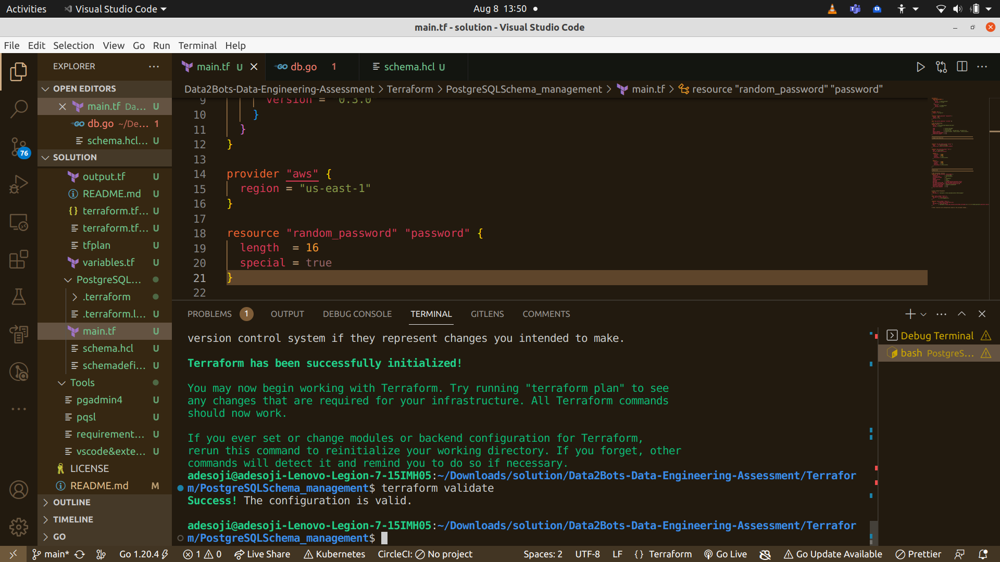
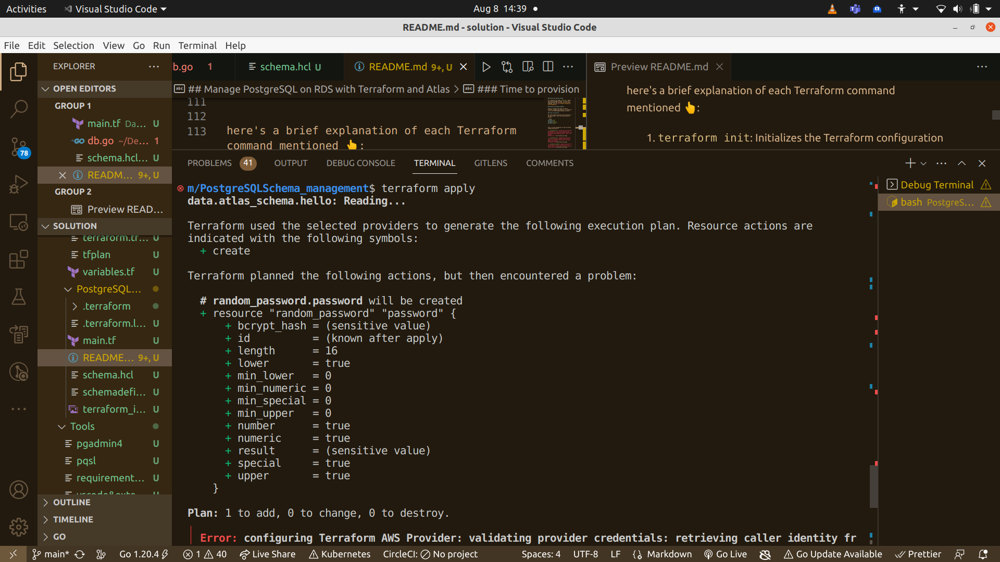

<!-- BEGIN_TF_DOCS -->

🏁 : Start 

## Requirements

| Name | Version |
|------|---------|
| <a name="requirement_atlas"></a> [atlas](#requirement\_atlas) | 0.3.0 |
| <a name="requirement_aws"></a> [aws](#requirement\_aws) | ~> 4.0 |

## Providers

| Name | Version |
|------|---------|
| <a name="provider_atlas"></a> [atlas](#provider\_atlas) | 0.3.0 |
| <a name="provider_aws"></a> [aws](#provider\_aws) | 4.67.0 |
| <a name="provider_random"></a> [random](#provider\_random) | 3.5.1 |

## Modules

| Name | Source | Version |
|------|--------|---------|
| <a name="module_vpc"></a> [vpc](#module\_vpc) | terraform-aws-modules/vpc/aws | 3.16.1 |

## Resources

| Name | Type |
|------|------|
| [atlas_schema.hello](https://registry.terraform.io/providers/ariga/atlas/0.3.0/docs/resources/schema) | resource |
| [aws_db_instance.atlas-demo](https://registry.terraform.io/providers/hashicorp/aws/latest/docs/resources/db_instance) | resource |
| [aws_db_subnet_group.atlas](https://registry.terraform.io/providers/hashicorp/aws/latest/docs/resources/db_subnet_group) | resource |
| [aws_security_group.rds](https://registry.terraform.io/providers/hashicorp/aws/latest/docs/resources/security_group) | resource |
| [random_password.password](https://registry.terraform.io/providers/hashicorp/random/latest/docs/resources/password) | resource |
| [atlas_schema.hello](https://registry.terraform.io/providers/ariga/atlas/0.3.0/docs/data-sources/schema) | data source |
| [aws_caller_identity.current](https://registry.terraform.io/providers/hashicorp/aws/latest/docs/data-sources/caller_identity) | data source |

## Inputs

No inputs.

## Outputs

No outputs.


## Manage PostgreSQL on RDS with Terraform and Atlas

The implementation is found 👉  <a name="here"></a> [here](/Data2Bots-Data-Engineering-Assessment/Terraform/PostgreSQLSchema_management/main.tf)


Many teams use Terraform, a popular, open-source, infrastructure-as-code (IaC) tool created by HashiCorp to provision their cloud infrastructure.
RDS is a fully managed relational database service by AWS.
The popular AWS Terraform Provider can be used to easily provision database instances and manage them.
This guide shows how to use the Atlas Terraform Provider to manage the schema of an RDS-managed PostgreSQL database using Terraform as part of their IaC pipelines.

Schema management in IaC
Terraform is widely used in the industry to provision and manage resources in AWS. One of the popular use-cases teams use Terraform for is to provision the database backing their application on RDS (a fully managed relational database service) using the AWS Terraform Provider. The provider supports a resource named aws_db_instance to provision databases using RDS.

This resource can be used to configure many attributes of the database like the amount of storage, the engine and version of the database, backup settings, etc. However, when it comes to provisioning the database's schema itself, the AWS provider does not offer any support. As a result, many teams do not manage their database schemas as part of their infrastructure-as-code pipeline in Terraform.

In this guide, I will demonstrate how to use Terraform to both provision a MySQL database on AWS with RDS and manage its schema in a single pipeline.

### Prerequisites

Install Terraform (guide)
An AWS account (free-tier available) with credentials configured for Terraform
Source code
The full source code for this guide can be found on [Adesoji's](https://github.com/Adesoji1/Data2Bots-Data-Engineering-Assessment) repository on GitHub.


### Getting started

Create a new directory for our new Terraform project and in it a file named `main.tf`. In this file we will define all the required resources for our project. Start by configuring the providers which we will use in our project:

### Networking

Next, our database must reside in a network topology. We will use the AWS-maintained Terraform module terraform-aws-modules/vpc/aws for creating a new VPC for our demo.

ℹ️  A few things worth noting:

In a more realistic scenario we will not provision a dedicated VPC for our database, rather our database will reside in a more general-purpose VPC which will include compute and other resources.
For the sake of simplicity we are placing our instance in public subnets. In a production use case, it is usually recommended to provision specific subnets for databases which should not be reachable from the internet.

### Security groups

Next, we provision the security group which governs access to our database instance. Notice: in this demo we are creating a database which is accessible from the public internet. The reason we need this is that we are running Terraform locally and need it to be able to connect to the database directly in order to manage our schema. In a realistic scenario, we will run Terraform from a server which is located in our VPC and can access our database.

### Provision the database

Next, we use the aws_db_instance to provision a new database instance:

### Define the desired schema

In a separate file named `schema.hcl` define the desired database schema. To learn more about defining SQL resources with the Atlas language, see the [docs](https://atlasgo.io/atlas-schema/hcl)

### Connect everything together

Finally, configure the Atlas Terraform Provider to apply the schema in our schema.hcl file on the RDS-managed database instance.

### Time to provision

We're now ready to provision the resources in our AWS account. Start by initializing the project:

```bash
terraform init
terraform plan
terraform validate
terraform apply

```

here's a brief explanation of each Terraform command mentioned 👆:

1. `terraform init`: Initializes the Terraform configuration in the current directory by downloading the necessary provider plugins and setting up the working directory. look 👇 for example  


2. `terraform plan`: Generates an execution plan that shows what changes Terraform will make to the infrastructure without actually making any changes.


3. `terraform validate`: Checks the syntax and configuration of your Terraform files to ensure they are valid and correctly formatted.


4. `terraform apply`: Applies the changes specified in your Terraform configuration, creating or modifying resources according to the execution plan.


for number 2 and 4 , the output 👆 is `expected` because no user authentication for database and aws were not provided

Should you make any corrections in the course of modifying your terraform scripts, run the terraform init. when you want to delete and unroll all the deploymnet, run 👇

```bash
terraform destroy

```


❌ : Warning, Likely Challenge or problems, look 👇

terraform plan
data.atlas_schema.hello: Reading...

Terraform used the selected providers to generate the following execution plan. Resource actions are
indicated with the following symbols:
  + create

Terraform planned the following actions, but then encountered a problem:

  # random_password.password will be created
  + resource "random_password" "password" {
      + bcrypt_hash = (sensitive value)
      + id          = (known after apply)
      + length      = 16
      + lower       = true
      + min_lower   = 0
      + min_numeric = 0
      + min_special = 0
      + min_upper   = 0
      + number      = true
      + numeric     = true
      + result      = (sensitive value)
      + special     = true
      + upper       = true
    }

Plan: 1 to add, 0 to change, 0 to destroy.
╷
│ Error: configuring Terraform AWS Provider: validating provider credentials: retrieving caller identity from STS: operation error STS: GetCallerIdentity, https response error StatusCode: 403, RequestID: f0babba4-d772-436b-9391-6e617d4efc0a, api error InvalidClientTokenId: The security token included in the request is invalid.
│ 
│   with provider["registry.terraform.io/hashicorp/aws"],
│   on main.tf line 14, in provider "aws":
│   14: provider "aws" {
│ 
╵
╷
│ Error: Client Error
│ 
│   with data.atlas_schema.hello,
│   on main.tf line 95, in data "atlas_schema" "hello":
│   95: data "atlas_schema" "hello" {
│ 
│ Unable to open connection, got error: postgres: scanning system variables: pq: password authentication
│ failed for user "atlas"

## Reason for problem

No user Authentication provided, to resolve, do this 👇
The error messages you're encountering indicate a few issues:

1. **STS Token Error:** The first error message indicates that Terraform encountered an issue while trying to retrieve your AWS caller identity using the Security Token Service (STS). The error message suggests that the security token included in the request is invalid. This could be due to an issue with your AWS credentials or permissions.

2. **PostgreSQL Authentication Error:** The second error message is related to PostgreSQL authentication. It indicates that there was a failure in password authentication for the "atlas" user. This error is likely caused by incorrect or missing credentials in your connection URL.

Here are steps you can take to address these issues:

For the STS Token Error:

1. Ensure that you have properly configured your AWS credentials by setting the `AWS_ACCESS_KEY_ID` and `AWS_SECRET_ACCESS_KEY` environment variables or by using other authentication methods like IAM roles or the AWS CLI configuration. refer to <a name="here"></a> [this](/Data2Bots-Data-Engineering-Assessment/Terraform/PostgreSQLRDS_management/Automated-RDS-Backup-and-Restore-Strategy-main/README.md) to configure your aws

2. Double-check that the AWS credentials you're using have the necessary permissions to perform the actions defined in your Terraform configuration.

For the PostgreSQL Authentication Error:

1. Make sure that the password you're using in the `local.dev_db_url` and the Atlas Schema Management `url` is correct. The error suggests that there is an issue with the password authentication for the "atlas" user.

2. Verify that the user "atlas" has the necessary permissions to access the PostgreSQL database as well.

3. Ensure that the PostgreSQL database is correctly configured to allow connections from the specified IP or hostname.

It's important to address both sets of errors to ensure that your Terraform configuration can be executed successfully. Double-checking your AWS credentials, PostgreSQL authentication, and database permissions will help resolve these issues.

### Wrapping up

In this guide, i have  demonstrated how to provision and manage a PostgreSQL instance using Terraform and the AWS and Atlas providers. Following the example here, teams can finally integrate schema management with their full Infrastructure-as-Code workflows.

### Reference

[link](https://atlasgo.io/guides/mysql/terraform#getting-started)

🔚 : End
<!-- END_TF_DOCS -->